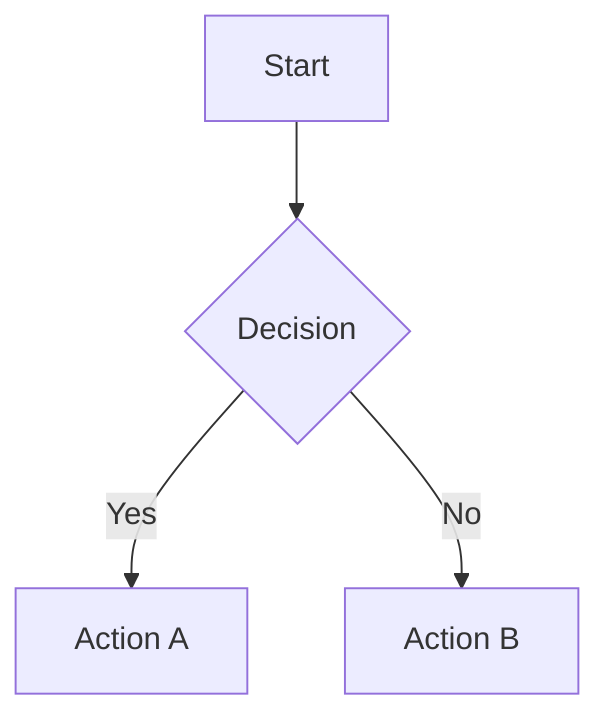

# remark-mdx-mermaid

[](https://www.gnu.org/licenses/mit)
[](https://www.npmjs.com/package/remark-mdx-mermaid)
[](https://www.npmjs.com/package/remark-mdx-mermaid)

A remark plugin for MDX that transforms fenced `mermaid` code blocks into `<Mermaid>` JSX elements, paired with a `useMermaid` React hook that handles rendering.

## Installation

```bash
npm install remark-mdx-mermaid
```

## Usage

### 1. Add the plugin to your MDX config

```js
// next.config.mjs
import remarkMermaid from "remark-mdx-mermaid";

const withMDX = createMDX({
  options: {
    remarkPlugins: [remarkMermaid],
  },
});

export default withMDX(nextConfig);
```

### 2. Build a component with `useMermaid`

```tsx
import { useMermaid } from "remark-mdx-mermaid/react";

const config = {
  theme: "base",
  darkMode: false,
  themeVariables: {
    primaryColor: "#e0f2fe",
  },
};

export default function Mermaid({ chart }: { chart: string }) {
  const { svg, isLoading, error } = useMermaid({ chart, config });

  if (isLoading) return <p>Loading...</p>;
  if (error) return <p>Failed to render diagram</p>;

  return <div dangerouslySetInnerHTML={{ __html: svg }} />;
}
```

### 3. Register the component in your MDX provider

```tsx
// mdx-components.tsx
import Mermaid from "@/components/Mermaid";
import type { MDXComponents } from "mdx/types";

export function useMDXComponents(components: MDXComponents): MDXComponents {
  return {
    ...components,
    Mermaid,
  };
}
```

### 4. Write diagrams in your MDX

````md

````

## Dark Mode

> **Notice:** Custom dark mode was removed in version 1.1.0 because Mermaid sometimes failed to render when switching themes. This feature was unstable and has therefore been deprecated.

Recommended to use this with `invert-colors` style with mermaid theming.

### Tailwind CSS

```jsx
<div className="dark:invert" dangerouslySetInnerHTML={{ __html: svg }} />
```

## API

### Plugin: `remarkMermaid` (default export from `remark-mdx-mermaid`)

Visits all `code` nodes with `lang: "mermaid"` in the MDX AST and replaces them with a `<Mermaid chart="..." />` JSX element. No options required.

### `useMermaid({ chart, config })` (named export from `remark-mdx-mermaid/react`)

| Parameter | Type            | Description                       |
| --------- | --------------- | --------------------------------- |
| `chart`   | `string`        | Mermaid diagram definition string |
| `config`  | `MermaidConfig` | Mermaid config object             |

Returns:

| Property    | Type                 | Description                           |
| ----------- | -------------------- | ------------------------------------- |
| `svg`       | `string`             | Rendered SVG markup                   |
| `isLoading` | `boolean`            | `true` while rendering is in progress |
| `error`     | `Error \| undefined` | Set if rendering failed               |

> **Note:** `mermaid.initialize()` is called only once globally. Subsequent renders reuse the existing configuration.
