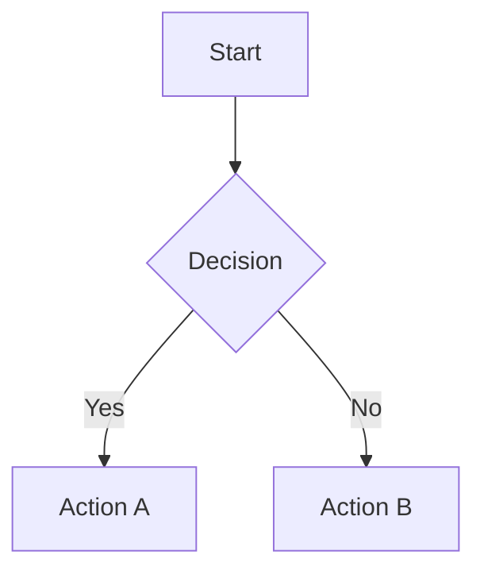

# remark-mdx-mermaid

[](https://www.gnu.org/licenses/mit)
[](https://www.npmjs.com/package/remark-mdx-mermaid)
[](https://www.npmjs.com/package/remark-mdx-mermaid)

A remark plugin for MDX that transforms fenced [mermaid](https://mermaid.js.org/) code blocks into `<Mermaid>` JSX elements, paired with a React component that renders them as inline SVGs.

## Installation

```bash
npm install remark-mdx-mermaid
```

## Usage

### 1. Add the plugin to your MDX config

```js
// next.config.mjs
import remarkMermaid from "remark-mdx-mermaid";

const withMDX = createMDX({
  options: {
    remarkPlugins: [remarkMermaid],
  },
});

export default withMDX(nextConfig);
```

### 2. Register the React component

```tsx
// mdx-components.tsx
import Mermaid from "remark-mdx-mermaid/react";
import type { MDXComponents } from "mdx/types";

export function useMDXComponents(components: MDXComponents): MDXComponents {
  return {
    ...components,
    Mermaid: (props) => (
      <Mermaid
        {...props}
        config={{
          theme: "base",
          darkMode: true,
          themeVariables: {
            primaryColor: ["#e0f2fe", "#0f172a"],
          },
        }}
      />
    ),
  };
}
```

### 3. Write diagrams in your MDX

````md

````

## Dark Mode

`themeVariables` supports a `[light, dark]` tuple. When `config.darkMode` is `true`, the second value is used automatically.

```ts
darkMode: true, // or false to use light mode
themeVariables: {
  primaryColor: ["#dbeafe", "#1e3a5f"],  // [light, dark]
  lineColor: "#94a3b8",                  // same in both modes
}
```
